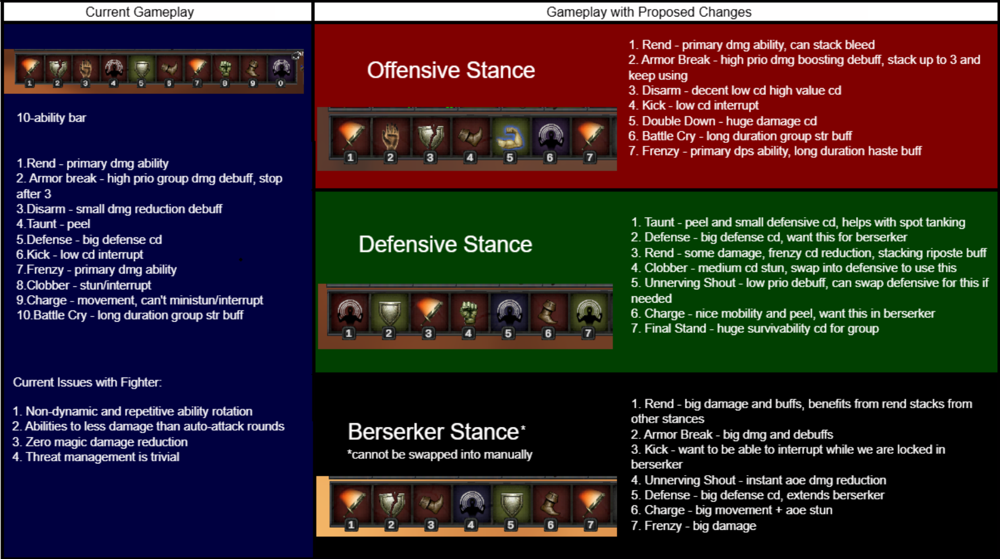
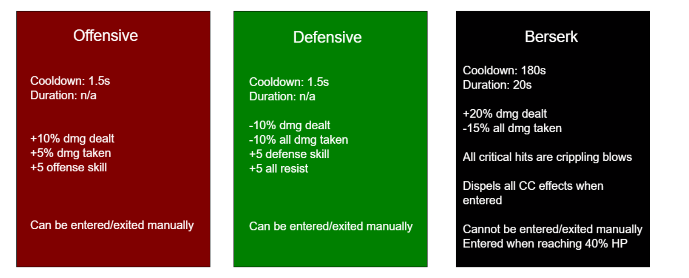

# Fighter Rework: Monsters and Memories

*A class identity redesign for the Fighter, built around stances and ability interactions.*

**[Read the design doc (PDF)](docs/mnm-fighter-rework.pdf)** · [Word version (download)](docs/mnm-fighter-rework.docx)

A design sample written in June 2026 during the beta of [Monsters and Memories](https://monstersandmemories.com/), a classic-style fantasy MMO (with deep inspirations drawing from Everquest and early World of Warcraft), and shared with the game's community, where it was well received. It's an independent fan proposal, not affiliated with or endorsed by the game's developers.

## The problem

In the beta as of June 2026, the Fighter was a capable tank but didn't have a distinct identity of its own. Its kit played as a flat priority list on a 10-ability bar:

- a repetitive rotation with few real decisions;
- most abilities dealt less damage than auto-attack rounds;
- no magic damage reduction;
- threat management was trivial.

## Design goals

1. Build the Fighter's identity from systems it already has and no other class shares: **Stances** and **Berserk**.
2. Make the playstyle more engaging and dynamic, in a way that fits the class fantasy.
3. Keep the Fighter a viable tank and damage dealer, with a play experience distinct from the other tanks.

Balance matters, but it's out of scope here: every value in the doc is illustrative.

## The proposal

Three stances, each with its own 7-ability bar:

- **Offensive** and **Defensive** are entered and left manually.
- **Berserk** can't be chosen. It triggers at 40% health, lasts 20 seconds on a 3 minute cooldown, and breaks crowd control when it starts.
- Every ability does something different depending on the stance it's used in. Cooldowns are shared across stances, and only the active stance's bar is visible.
- Players choose which abilities go on their Offensive and Defensive bars. The Berserker bar can only use abilities already bound to one of the other two, so loadout choices carry into Berserk.

## Highlights

- **Abilities that build across stances.** Rend applies stacking bleeds in Offensive Stance and stacking riposte buffs in Defensive. In Berserker Stance it consumes both, cashing in the bleeds as damage and turning the riposte stacks into a short window of guaranteed ripostes.
- **Debuffs that escalate.** Unnerving Shout and Armor Break stay useful past their first or third cast. Their Berserker versions jump straight to the full effect or upgrade it.
- **Utility with a second use.** Kick, Charge and Taunt each gain a stance-specific use: an immobilize, a charge to an ally that shields them, or a shorter Charge cooldown when the taunted target hits you.
- **New tools that fit the fantasy.** *Double Down* commits you to your current stance for a stronger version of it. *Riposte* gives the class a passive counterattack built into its defensive identity.
- **Fewer abilities, more decisions.** Two abilities are removed and the bar shrinks from 10 to 7 slots per stance, but every slot does more.

## Risks and open questions

- **Learning curve and UI.** Three bars with stance-specific effects are a lot to learn, and they need clear tooltips and visual feedback to stay readable.
- **An automatic Berserk** takes control away from the player at a critical moment, and could be abused, for example by tanking down to 40% health on purpose.
- **Balance and PvP.** Values are placeholders, and the stun, snare and dispel effects would need a dedicated PvP pass.

## What happened next

A few months later (August 2026) the developers published their own Fighter rework ([Fighter deep dive](https://monstersandmemories.com/class-fighter-deep-dive)). It went in a similar direction on several points, each solved in its own way:

| | This proposal (June 2026) | The official rework (August 2026) |
| --- | --- | --- |
| Stances | Offensive and Defensive, plus a third, Berserker Stance | Offensive and Defensive, plus a third, Tactician Stance |
| Damage while tanking | Riposte, plus Rend stacks cashed in by Berserker Stance | Retaliation abilities fueled by Vengeance stacks gained from taking damage |
| Rend | Gains cooldown resets from Frenzy and Shield Bash in Berserker Stance | Gains cooldown resets |
| Berserker stance dispels CC effects when entered | Tactician stance increases resistance to CC effects |

The official version leans on new abilities and a damage-taken resource rather than changing what existing abilities do in each stance.

## Contents

| Path | What it is |
| --- | --- |
| `docs/mnm-fighter-rework.pdf` | The full design document |
| `docs/mnm-fighter-rework.docx` | Editable version |
| `images/` | The stance overview and gameplay comparison from the doc |

## See also

- [Keep the Rage, Cap the Scaling](https://github.com/speak-gg/warrior-rage-proposal): a data-driven rage and class-tuning proposal for World of Warcraft: Forever.

Author: speak-gg
